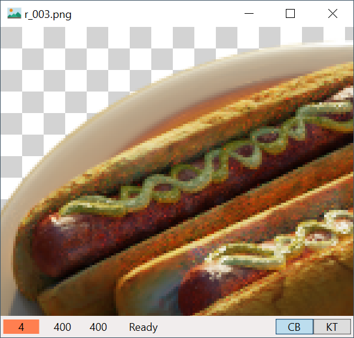

## Simple Image Viewer

Alternative image viewer for Windows 10.

---

### Features

Simple Image Viewer is built to replace the Photos App shipped with Windows 10. It emerged from the idea of having a viewer that starts faster, with minimum features required, including:

- Displaying an image
- Zooming, moving, and rotating the image

Thus the name _simple_. As time goes by, more features have been added:

- View GIFs
- Scroll through long images
- Draw a chessboard background for viewing transparency better
- Keep the transform (scale, translation, rotation) when navigating between images
- Zoom to integer levels with `Ctrl+1` ~ `Ctrl+9` key combinations, and zoom to fit in window (default) with `Ctrl+0`
- Put the image to clipboard with `Ctrl+C`

Compared with Photos, it has several advantages:

- It starts faster
- It does not show you a blurry image for a fraction of a second
- Move the image wherever you like
- Being able to zoom GIFs

### Screenshots

(Sources: [screenshot 1](https://www.zhihu.com/question/49014306/answer/336572244), [screenshot 2](https://github.com/bmild/nerf))

### Building & running

Simple Image Viewer was developed for my daily use, so it's not released as a binary. The code here is for sharing my experience with .Net and WPF.

If you're interested (thank you!), you can clone and build it with Visual Studio 2019. The program takes one command line argument, the full name of the image.

### License

The source code is published under the [DBAD](https://dbad-license.org/) public license.

### Credits

The icon is made by [Smashicons](https://www.flaticon.com/authors/smashicons) from [www.flaticon.com](https://www.flaticon.com/)
